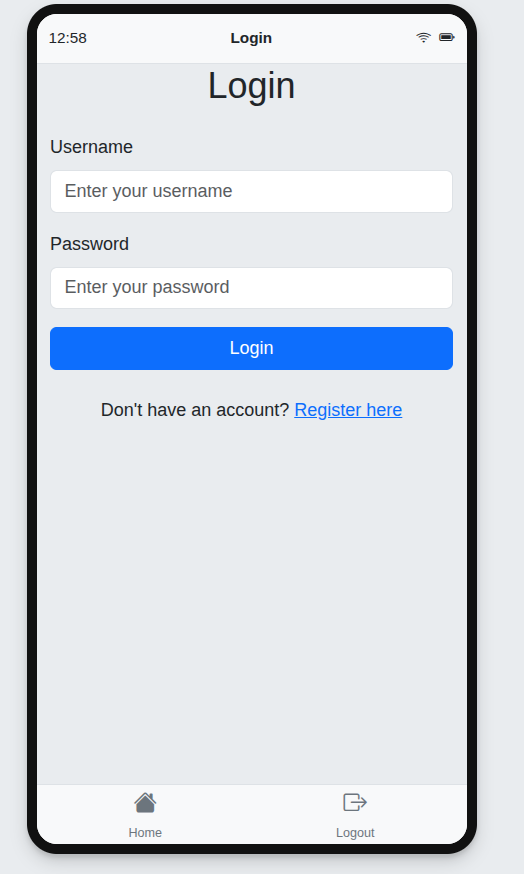
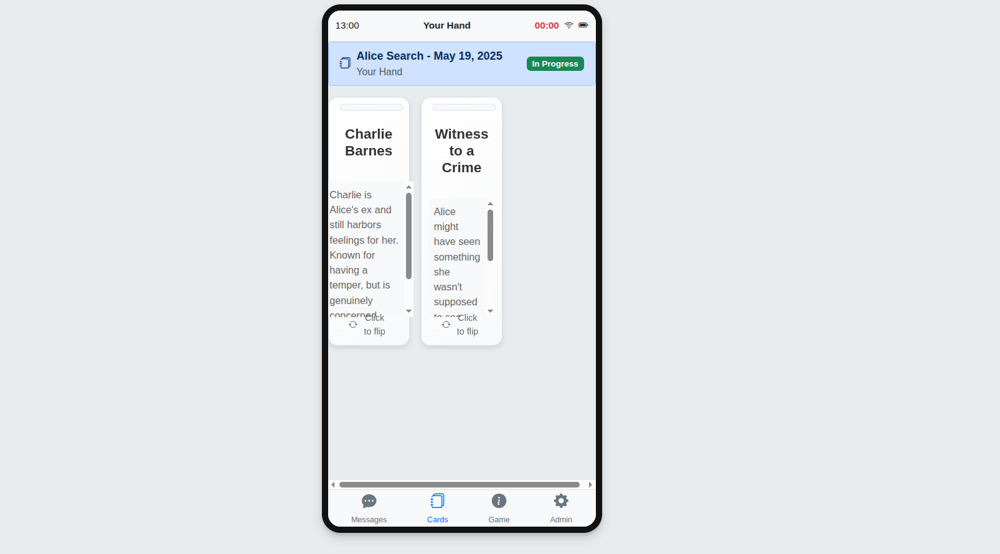
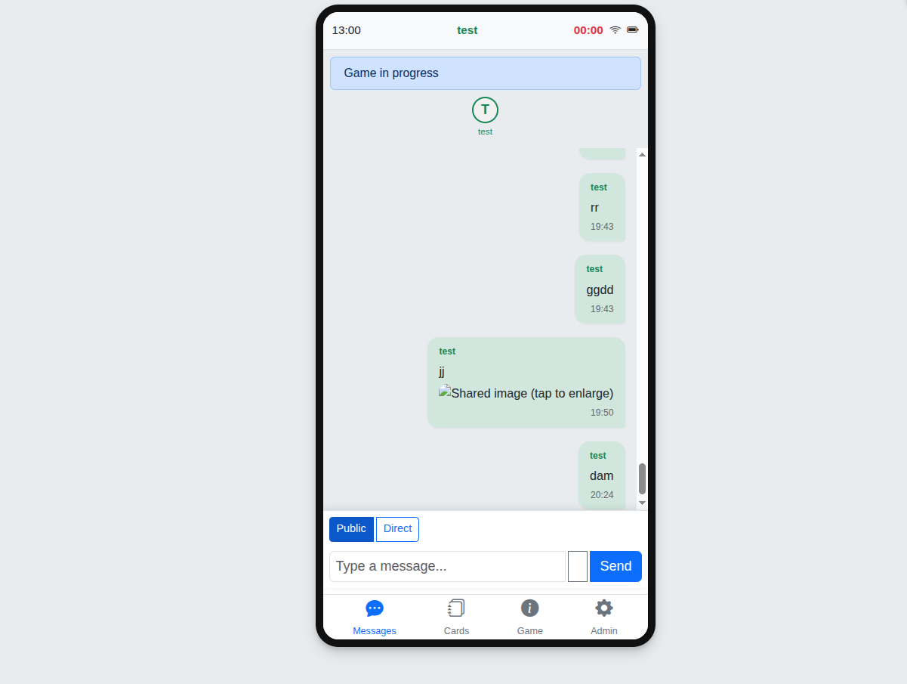
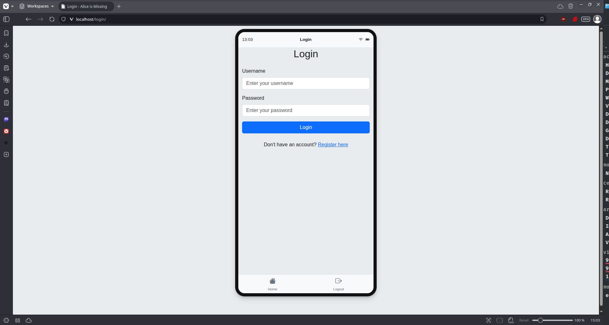
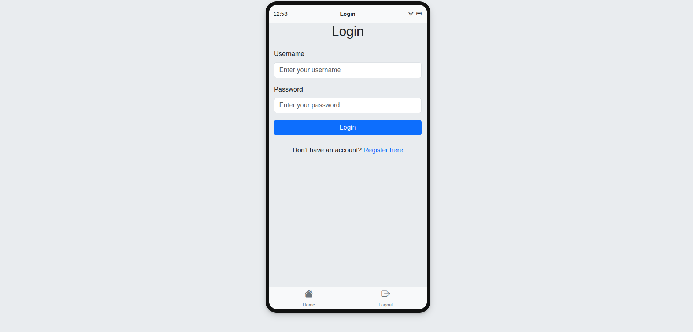

# Alice Is Missing - Application Web de Jeu de Rôle Silencieux

[](https://www.djangoproject.com/)
[](https://www.docker.com/)
[](https://gunicorn.org/)

## Table des Matières
- [Introduction](#introduction)
- [Captures d'écran](#captures-décran)
- [Stack Technique](#stack-technique)
- [Fonctionnalités](#fonctionnalités)
- [Installation](#installation)
- [Structure du Projet](#structure-du-projet)
- [Développement](#développement)
- [Maintenance](#maintenance)

## Introduction

Alice Is Missing est une adaptation numérique du jeu de rôle silencieux où les joueurs utilisent une interface de messagerie pour résoudre la mystérieuse disparition d'Alice Briarwood. Cette application web facilite la gestion des parties en ligne, permettant aux joueurs de participer à distance tout en maintenant l'ambiance unique du jeu original.

L'application gère automatiquement la distribution des cartes, le chronomètre de jeu, et les échanges de messages entre les joueurs, créant une expérience immersive et fluide.

## Captures d'écran

### Interface de Connexion

*Page de connexion pour les joueurs*

### Système de Cartes

*Gestion et affichage des cartes de jeu*

### Système de Messagerie

*Interface de messagerie entre les joueurs*

### Vue Complète de l'Interface

*Vue d'ensemble de l'interface de jeu*

### Interface Web

*Vue détaillée de l'interface utilisateur*

## Stack Technique

- **Framework Web**: Django 5.1.4
- **Gestion d'Images**: Pillow 10.0.0
- **Serveur WSGI**: Gunicorn 21.2.0
- **Base de Données**: SQLite
- **Conteneurisation**: Docker
- **Serveur Web**: Nginx (reverse proxy)

## Fonctionnalités

### Gestion des Joueurs et des Parties
- Création et gestion de comptes utilisateurs
- Configuration personnalisée des parties
- Attribution automatique des rôles
- Système de chronomètre intégré

### Système de Cartes
- Distribution automatique des cartes
- Interface intuitive de visualisation
- Gestion des cartes spéciales et des indices
- Révélation progressive du contenu

### Système de Messagerie
- Chat en temps réel entre joueurs
- Support des messages privés et publics
- Intégration d'images et d'indices
- Historique des conversations

### Interface d'Administration
- Gestion complète des parties
- Supervision des joueurs
- Configuration des paramètres de jeu
- Outils de modération

## Installation

### Prérequis
- Docker
- Docker Compose
- Git

### Installation avec Docker

1. Cloner le repository :
```bash
git clone [URL_DU_REPO]
cd aliceismissing
```

2. Construire l'image Docker :
```bash
./build.sh
```

3. Démarrer l'application :
```bash
./run.sh
```

Par défaut, l'application sera accessible sur le port 80. Pour utiliser un port différent :
```bash
./run.sh -p 8081
```

### Configuration

Variables d'environnement nécessaires :
```env
DJANGO_SETTINGS_MODULE=aliceismissing.settings
PYTHONUNBUFFERED=1
PYTHONDONTWRITEBYTECODE=1
```

## Structure du Projet

```
aliceismissing/
├── app/                # Tests et configurations d'application
├── game/              # Application principale du jeu
│   ├── migrations/    # Migrations de base de données
│   ├── templates/     # Templates Django
│   └── templatetags/  # Tags de template personnalisés
├── media/             # Fichiers uploadés
├── static/            # Fichiers statiques
├── templates/         # Templates globaux
│   └── game/         # Templates spécifiques au jeu
└── docker/            # Configurations Docker
```

### Composants Clés
- `game/models.py`: Modèles de données du jeu
- `game/views.py`: Logique de vue
- `game/urls.py`: Configuration des URLs
- `templates/game/`: Templates HTML du jeu

## Développement

### Configuration Locale

1. Créer un environnement virtuel :
```bash
python -m venv venv
source venv/bin/activate  # Linux/macOS
```

2. Installer les dépendances :
```bash
pip install -r requirements.txt
```

3. Appliquer les migrations :
```bash
python manage.py migrate
```

4. Lancer le serveur de développement :
```bash
python manage.py runserver
```

### Tests

Exécuter les tests :
```bash
./run_tests.sh
```

Les tests couvrent :
- Système de messagerie
- Gestion des personnages
- Logique de jeu
- Interface utilisateur

### Sauvegarde

Éléments à sauvegarder régulièrement :
- Base de données SQLite
- Fichiers média uploadés
- Configurations personnalisées

## Maintenance

### Logs
Accéder aux logs du conteneur :
```bash
docker logs alice-is-missing
```

### Mise à Jour
1. Arrêter le conteneur
2. Tirer les dernières modifications
3. Reconstruire l'image
4. Redémarrer le conteneur

### Dépannage

Problèmes courants :
1. Port déjà utilisé :
   - Utiliser un port différent avec l'option `-p`
2. Erreurs de base de données :
   - Vérifier les permissions des fichiers
   - Contrôler les montages de volumes

Pour toute assistance supplémentaire, consulter les logs ou contacter l'administrateur système.

## Build and Run Scripts

### build.sh
```bash
#!/bin/bash

# Exit on error
set -e

# Default values
IMAGE_NAME="alice-is-missing"
VERSION="latest"

# Parse command line arguments
while [[ $# -gt 0 ]]; do
    case $1 in
        -v|--version)
            VERSION="$2"
            shift 2
            ;;
        *)
            echo "Unknown argument: $1"
            exit 1
            ;;
    esac
done

echo "Building Docker image ${IMAGE_NAME}:${VERSION}..."

# Build the image
docker build -t "${IMAGE_NAME}:${VERSION}" .

# Tag as latest if version is not "latest"
if [ "$VERSION" != "latest" ]; then
    docker tag "${IMAGE_NAME}:${VERSION}" "${IMAGE_NAME}:latest"
fi

echo "Build completed successfully!"
```

### run.sh
```bash
#!/bin/bash

# Exit on error
set -e

# Default values
CONTAINER_NAME="alice-is-missing"
IMAGE_NAME="alice-is-missing"
VERSION="latest"
PORT=80

# Parse command line arguments
while [[ $# -gt 0 ]]; do
    case $1 in
        -v|--version)
            VERSION="$2"
            shift 2
            ;;
        -p|--port)
            PORT="$2"
            shift 2
            ;;
        *)
            echo "Unknown argument: $1"
            exit 1
            ;;
    esac
done

# Stop and remove existing container if running
if [ "$(docker ps -q -f name=${CONTAINER_NAME})" ]; then
    echo "Stopping existing container..."
    docker stop ${CONTAINER_NAME}
fi

if [ "$(docker ps -aq -f name=${CONTAINER_NAME})" ]; then
    echo "Removing existing container..."
    docker rm ${CONTAINER_NAME}
fi

echo "Starting container ${CONTAINER_NAME}..."

# Run the container
docker run -d \
    --name ${CONTAINER_NAME} \
    -p ${PORT}:80 \
    -v $(pwd)/db.sqlite3:/app/db.sqlite3 \
    -v $(pwd)/media:/app/media \
    -v $(pwd)/static:/app/static \
    --restart unless-stopped \
    ${IMAGE_NAME}:${VERSION}

echo "Container started successfully!"
```

These scripts provide an easy way to build and run the Docker container. The build script supports version tagging, and the run script allows for custom port mapping and handles container lifecycle management.

## Installation & Setup

### 1. Build the Docker Image
```bash
./build.sh
```

Optional: Specify a version tag:
```bash
./build.sh -v 1.0.0
```

### 2. Run the Container
```bash
./run.sh
```

Optional: Specify a custom port:
```bash
./run.sh -p 8081
```

## Configuration

### Environment Variables
The application uses the following environment variables:
- `DJANGO_SETTINGS_MODULE`: Set to `aliceismissing.settings`
- `PYTHONUNBUFFERED`: Set to 1 for unbuffered Python output
- `PYTHONDONTWRITEBYTECODE`: Set to 1 to prevent Python from writing bytecode

### Persistent Storage
The following directories are configured as Docker volumes:
- `/app/media`: For user-uploaded files
- `/app/static`: For static files
- `/app/db.sqlite3`: For the SQLite database

### Ports
- Default exposed port: 80 (in container)
- Can be mapped to any host port via the run script

## Architecture

### Container Components
1. **Nginx**
   - Serves as reverse proxy
   - Handles static/media file serving
   - Provides HTTP server functionality

2. **Gunicorn**
   - WSGI application server
   - Runs with 3 worker processes
   - Handles Python application execution

3. **Django**
   - Web application framework
   - Handles routing and business logic
   - Manages database operations

### Security Features
- Runs as non-root user
- Implements security headers
- Uses secure Nginx configuration
- Implements health checks

## Development

### Local Development
1. Create a virtual environment:
```bash
python -m venv venv
source venv/bin/activate  # On Unix
```

2. Install dependencies:
```bash
pip install -r requirements.txt
```

3. Run migrations:
```bash
python manage.py migrate
```

4. Start development server:
```bash
python manage.py runserver
```

### Building for Production
1. Update requirements.txt if needed
2. Build new Docker image
3. Test thoroughly
4. Deploy new version

## Maintenance

### Backups
The SQLite database is persisted through a Docker volume. Regular backups should be maintained of:
- The SQLite database file
- Media uploads
- Static files

### Logs
Logs are available through:
```bash
docker logs alice-is-missing
```

### Health Checks
The application includes a health check endpoint at `/health/`

## Troubleshooting

### Common Issues
1. Port already in use:
   - Use a different port with `-p` option in run.sh

2. Permission issues:
   - Ensure proper ownership of mounted volumes

3. Database errors:
   - Check volume mounts
   - Verify database file permissions

### Getting Help
For issues or questions:
1. Check the logs
2. Verify configurations
3. Contact system administrator

## License

This project is licensed under the Apache License 2.0 - see the [Apache License 2.0](https://www.apache.org/licenses/LICENSE-2.0) for details.

## Contributors

- [ernaud-breissie](https://github.com/ernaud-breissie)
